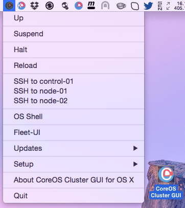

CoreOS-Vagrant Cluster GUI for OS X
============================

CoreOS-Vagrant Cluster GUI for Mac OS X is a Mac Status bar App which works like a wrapper around the [coreos-vagrant](https://github.com/coreos/coreos-vagrant) command line tool and bootstraps CoreOS cluster with one control (etcd) and two worker machines. Flannel network is set too.
 
[CoreOS](https://coreos.com) is a Linux distribution made specifically to run [Docker](https://www.docker.io/) containers.
[CoreOS-Vagrant](https://github.com/coreos/coreos-vagrant) is made to run on VirtualBox and VMWare VMs.



Download
--------
Head over to the [Releases Page](https://github.com/rimusz/coreos-osx-gui-cluster/releases) to grab the latest release.


How to install
----------

Required software
* [VirtualBox](https://www.virtualbox.org/wiki/Downloads), [Vagrant](http://www.vagrantup.com/downloads.html) and [iTerm 2](http://www.iterm2.com/#/section/downloads)

* Download `CoreOS Cluster GUI latest.zip` from the [Releases Page](https://github.com/rimusz/coreos-osx-gui-cluster/releases) and unzip it.
* Start the `CoreOS Cluster GUI` and from menu `Setup` choose `Initial setup of CoreOS-Vagrant Cluster` 
* The install will do the following:
````
1) All dependent files/folders will be put under 'coreos-osx-cluster' folder in the user's 
 home folder e.g '/Users/someuser/coreos-osx-cluster'
2) Will clone latest coreos-vagrant from git
3) user-data file will have fleet, etcd and 'reboot off' set
4) control (etcd) machine will be set with IP `172.17.9.101` and two cluster nodes with IPs: `172.17.9.102 and 172.17.9.103`
5) Will download and install fleetctl and etcdctl clients to ~/coreos-osx-cluster/bin/
6) Will download latest vagrant VBox and run vagrant up to initialise VM
````

How it works
------------

Just start `CoreOS Cluster GUI` application and you will find a small icon with the CoreOS logo with the (C) which means for cluster in the Status Bar.

* There you can `Up`, `Suspend`, `Halt`, `Reload` CoreOS vagrant VMs
* Under `Up' and 'OS shell` OS Shell will have such environment set:
````
1) Path to ~/coreos-osx-cluster/bin where etcdclt and fleetctl binaries are stored
2) etcd endpoint - export ETCDCTL_PEERS=http://172.17.9.101:4001
3) fleetctl endpoint - export FLEETCTL_ENDPOINT=http://172.17.9.101:4001
````

* `SSH to control-01 and node-01/02` menu options will open VM shells.
* Updates/Update OS X fleetctl and etcdclt will update fleetctl, etcdclt clients to the same versions as CoreOS VMs run.
* Updates/Force CoreOS update will be run sudo update_engine_client -update on each CoreOS VM.
* Updates/Check updates for CoreOS vbox will update CoreOS VM vagrant box.
* [Fleet-UI](http://fleetui.com) dashboard will show running fleet units and etc


Other Apps
-----------
* Standalone CoreOS VM version of OS X App can be found here [CoreOS-OSX GUI](https://github.com/rimusz/coreos-osx-gui).
* Kubernetes Solo Cluster VM App can be found here [Kube Solo](https://github.com/rimusz/kube-solo-osx)
* Kubernetes Solo Vagrant based Cluster VM App can be found here [CoreOS-Vagrant Kubernetes Solo GUI](https://github.com/rimusz/coreos-osx-gui-kubernetes-solo)
* Kubernetes Cluster one CoreOS VM of OS X App can be found here [CoreOS-Vagrant Kubernetes Cluster GUI ](https://github.com/rimusz/coreos-osx-gui-kubernetes-cluster).
